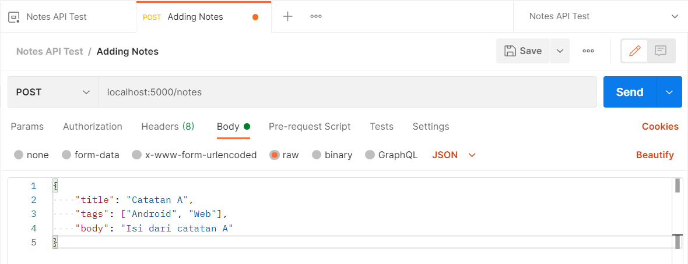
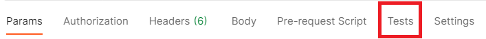
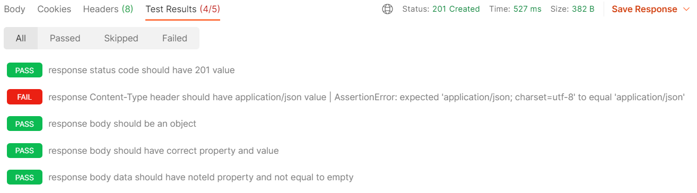

# Catatan Back-End
## Mengonsumsi dan Menguji RESTful API menggunakan Postman
### Skenario 1: Adding Notes (Memasukkan catatan baru):
* Pastikan response memiliki status code 201.
* Pastikan header response Content-Type memiliki nilai application/json.
* Pastikan body response adalah object.
* Pastikan body response memiliki properti dan nilai yang sesuai.
* Pastikan data pada response body memiliki noteId dan nilainya tidak kosong.

#### 1. Pastikan response memiliki status code 201.
Masukkan data di bawah ke dalam tab Body, pilih opsi raw, kemudian ganti format text menjadi JSON
```Json
{
   "title": "Catatan A",
   "tags": ["Android", "Web"],
   "body": "Isi dari catatan A"
} 
```


Selanjutnya pilih tab Tests


Buat testing baru dengan nama ‘response status code should have 201 values’.
```Javascript
pm.test('response status code should have 201 value', () => {
   
});
```
Pastikan respoinse status bernilai 201 dengan cara:
```Javascript
pm.test('response status code should have 201 value', () => {
   pm.response.to.have.status(201);
}); 
```
#### 2. Pastikan header response Content-Type memiliki nilai application/json.
Buat test dengan nama ‘response Content-Type header should have application/json value’.
```Javascript
pm.test('response Content-Type header should have application/json value', () => {
 
}); 
```
Kemudian uji nilai Content-Type pada response header dengan nilai application/json.
```Javascript
pm.test('response Content-Type header should have application/json value', () => {
  pm.expect(pm.response.headers.get('Content-Type')).to.equals('application/json');
});
```
#### 3. Pastikan body response adalah object.
Buat test dengan nama ‘response body should be an object’.
```Javascript
pm.test('response body should be an object', () => {
 
});
```
Kemudian dapatkan nilai response body dalam bentuk JSON dengan cara:
```Javascript
pm.test('response body should be an object', () => {
   const responseJson = pm.response.json();
}); 
```
Selanjutnya uji responseJson bahwa ia harus merupakan sebuah objek. Caranya:
```Javascript
pm.test('response body should an object', () => {
    const responseJson = pm.response.json();
    pm.expect(responseJson).to.be.an('object');
}); 
```
#### 4. Pastikan body response memiliki properti dan nilai yang sesuai.
Lanjut. Silakan buat testing baru bernama ‘response body should have the correct property and value.’
```Javascript
pm.test('response body should have the correct property and value', () => {
    
});
```
Dapatkan response body dalam bentuk JSON dan uji kesesuaian properti serta nilai atau tipe datanya.
```Javascript
pm.test('response body should have correct property and value', () => {
    const responseJson = pm.response.json();
    pm.expect(responseJson).to.ownProperty('status');
    pm.expect(responseJson.status).to.equals('success');
    pm.expect(responseJson).to.ownProperty('message');
    pm.expect(responseJson.message).to.equals('Catatan berhasil ditambahkan');
    pm.expect(responseJson).to.ownProperty('data');
    pm.expect(responseJson.data).to.be.an('object');
});
```
#### 5. Pastikan data pada response body memiliki noteId dan nilainya tidak kosong.
Buat test baru dengan nama ‘response body data should have noteId property and not equal to empty’.
```Javascript
pm.test('response body data should have noteId property and not equal to empty', () => {
 
});
```
Di dalamnya, dapatkan nilai objek data dari response yang sudah diubah dengan bentuk JSON.
```Javascript
pm.test('response body data should have noteId property and not equal to empty', () => {
    const responseJson = pm.response.json();
    const { data } = responseJson;
});
```
Kemudian uji data bahwa ia harus memiliki properti noteId dan nilainya tidak kosong.
```Javascript
pm.test('response body data should have noteId property and not equal to empty', () => {
    const responseJson = pm.response.json();
    const { data } = responseJson;
 
    pm.expect(data).to.ownProperty('noteId');
    pm.expect(data.noteId).to.not.equals('');
});
```
>Seperti yang kita ketahui, ketika permintaan menambahkan catatan baru, respons akan mengembalikan noteId dari catatan baru tersebut. Simpanlah nilainya pada environment variabel noteId agar nilainya dapat digunakan pada skenario pengujian selanjutnya. 

>Untuk menyimpan nilai pada variabel environment, kita bisa gunakan method pm.environment.set(). Method tersebut menerima dua parameter, yakni nama variabel dan nilai yang akan ditetapkan padanya.
```Javascript
pm.test('response body data should have noteId property and not equal to empty', () => {
    const responseJson = pm.response.json();
    const { data } = responseJson;
 
    pm.expect(data).to.ownProperty('noteId');
    pm.expect(data.noteId).to.not.equals('');
 
    pm.environment.set('noteId', data.noteId);
});
```
Lalu klik send, dan hasilnya: 



> Ada satu pengujian yang gagal. Pesan eror mengatakan bahwa nilai Content-Type bukanlah “application/json” (expectation) namun “application/json; charset=utf-8” (actual). Untuk memperbaiki pengujian tersebut, kita perlu mengubah nilai ekspektasi menjadi “application/json; charset=utf-8”.
```Javascript
pm.test('response Content-Type header should have application/json value', () => {
  pm.expect(pm.response.headers.get('Content-Type')).to.equals('application/json; charset=utf-8');
}); 
```

### Skenario 2: Getting All Notes (Mendapatkan seluruh catatan):
